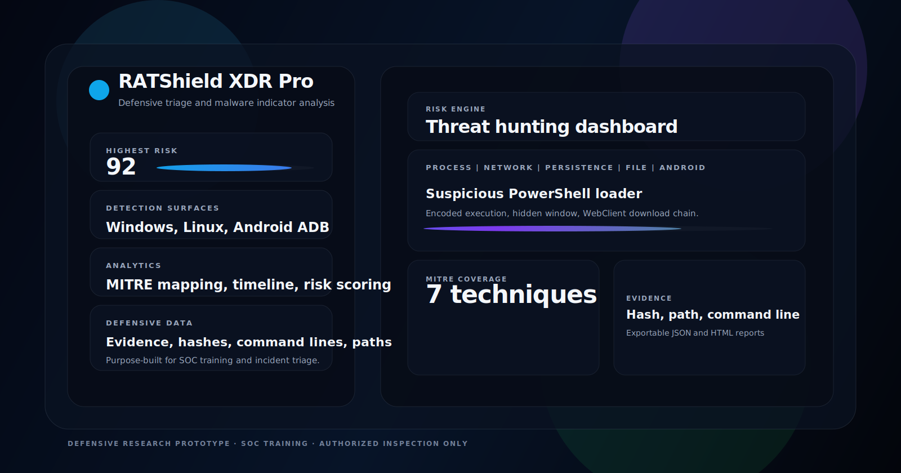
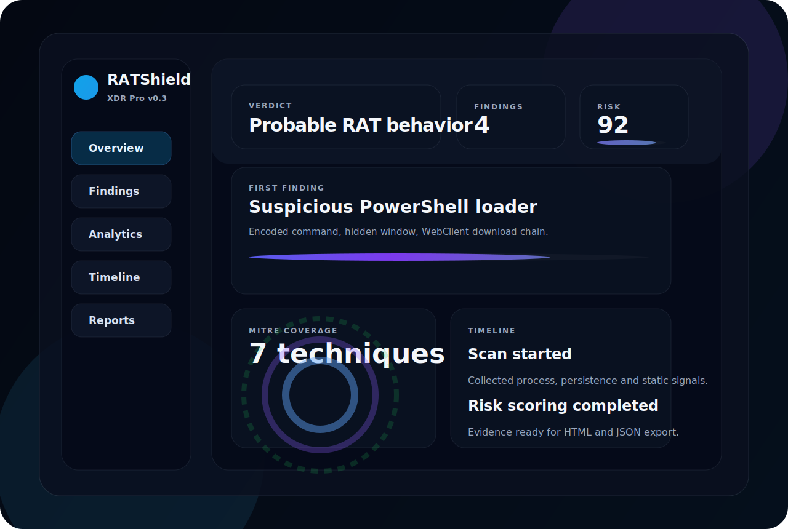

# RATShield XDR Pro



RATShield XDR Pro is a defensive triage and detection platform I built to help spot RAT-like behavior across Windows, Linux, and Android ADB-connected devices.

The idea was to keep the workflow practical: show the evidence clearly, score what matters, and make the findings easy to explain during a review. It is useful for SOC training, malware analysis exercises, and authorized inspection.



## What the project does

- Scans local host activity for suspicious process, persistence, and static indicators
- Analyzes Windows, Linux, and Android ADB-connected devices
- Scores findings by severity, confidence, and risk
- Maps findings to MITRE ATT&CK techniques
- Generates JSON and HTML investigation reports
- Provides a clear dashboard for analysts and demo visitors
- Supports safe classroom presentation through a built-in demo mode

## Detection approach

The engine combines several layers:

1. Process inspection
2. Persistence inspection
3. Static file analysis
4. Script and command-line rule matching
5. Lightweight behavior correlation
6. Android permission-cluster review
7. Human-readable evidence output

The scanner looks for patterns often used by modern RATs, trojans, loaders, and similar malware:

- PowerShell obfuscation and loader behavior
- `schtasks` masquerading and fake update task names
- LOLBin delivery chains such as `mshta`, `rundll32`, `regsvr32`, `certutil`, `bitsadmin`, `wscript`, and `cscript`
- Screen capture behavior
- Email or SMTP-based exfiltration markers
- Hidden-window or execution-policy tampering
- Suspicious persistence in Windows, Linux, and Android

## Screenshots

The same visual assets are used in the app, the README, and the landing page:


## Features

- FastAPI backend
- Dark XDR-style frontend dashboard
- Evidence-rich finding view
- Search, severity filtering, and sorting
- Selectable finding details panel
- Timeline and category analytics
- MITRE ATT&CK mapping
- Risk scoring with confidence
- SHA256, entropy, and string-rule checks
- Android ADB inspection
- JSON and HTML reporting
- Demo mode for safe presentations
- Allowlisting-ready structure

## Quick Start

```bash
python -m venv .venv
.venv\Scripts\activate          # Windows PowerShell
# source .venv/bin/activate     # Linux/macOS
pip install -r requirements.txt
uvicorn backend.app.main:app --reload --host 127.0.0.1 --port 8000
```

Open:

```text
http://127.0.0.1:8000
```

## CLI

```bash
python scripts/ratshield_cli.py --target demo
python scripts/ratshield_cli.py --target local
python scripts/ratshield_cli.py --target android
```

## API

- `POST /api/scan/demo`
- `POST /api/scan/local`
- `POST /api/scan/android`
- `GET /api/reports/latest-json`
- `GET /api/reports/latest-html`
- `GET /health`

## Project structure

```text
backend/
  app/
    api/         # HTTP routes
    core/        # rules, risk engine, reporting, static helpers
    models/      # schemas and typed results
    scanners/    # demo, local, and Android ADB scanners
frontend/        # modern single-page dashboard
assets/          # reusable SVG artwork for the app and site
scripts/         # CLI entrypoint
index.html       # GitHub Pages style landing page
```

## Public landing page

If you want to publish the repo as a GitHub Pages site, point Pages at the repository root so `index.html` and `assets/` are served directly.

## Portfolio and GitHub profile

Ready-made showcase content lives in:

- [`profile/README.md`](profile/README.md) for a GitHub profile page
- [`PORTFOLIO.md`](PORTFOLIO.md) for a case-study style portfolio entry

Use those files as the summary for the project.

## Safety

This project contains no RAT payload, exploit chain, persistence installer, or offensive automation. It only performs defensive inspection and safe sample generation.

## Positioning

> RATShield XDR Pro is a defensive tool for spotting RAT-like indicators across Windows, Linux, and Android. It is designed for SOC training, triage, and authorized inspection, not as a replacement for enterprise EDR or antivirus.
